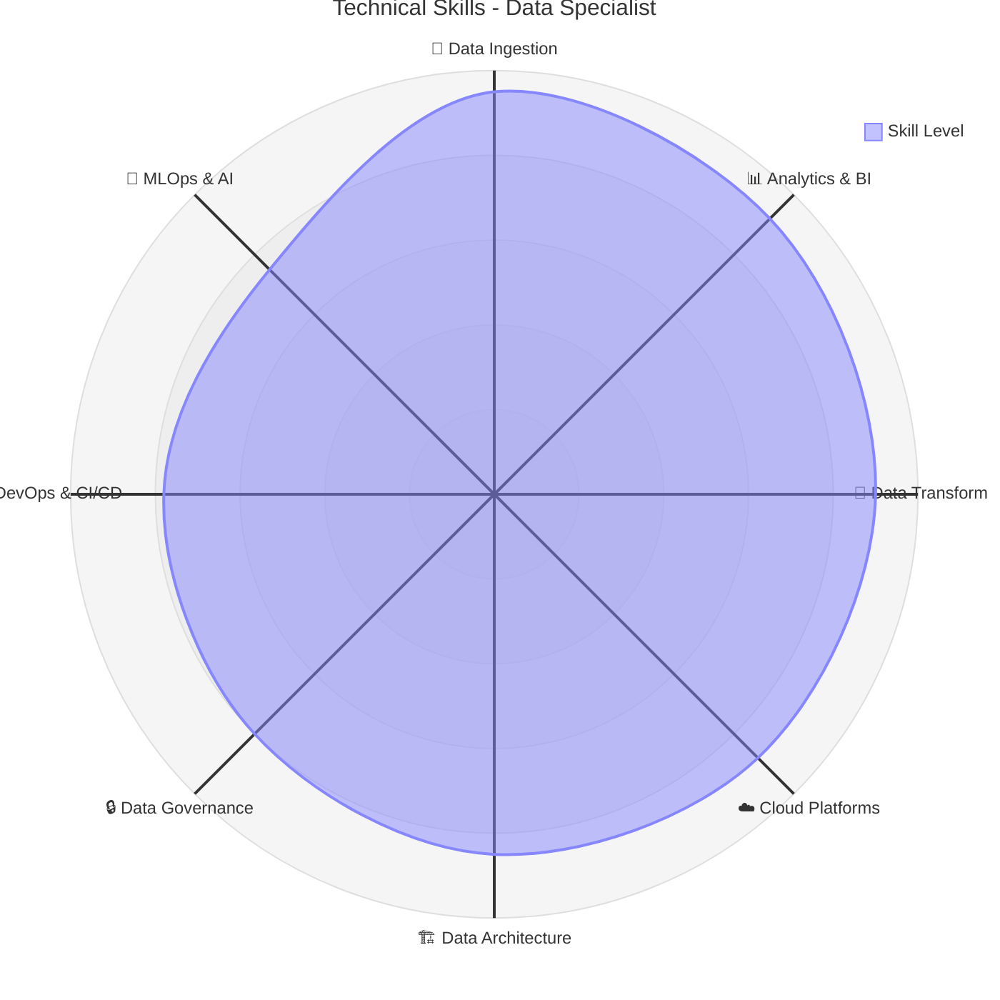

# 👋 Hi! I'm Erick Sang Cifuentes

  

  
  
  
  

---

## 🚀 About Me

**Full-spectrum data and technology professional.** From exploratory analysis to production ML architectures. I combine the analytical mindset of a Data Scientist, the technical skills of a Data Engineer, and the strategic vision of a Solutions Architect.

**My integral profile spans:**
- 📊 **Data Analytics**: From complex SQL to executive-level visualizations
- 🔧 **Data Engineering**: Robust pipelines, complex transformations, scalable architectures
- ☁️ **AWS/Azure/GCP Architecture**: EC2, Lambda, S3, BigQuery, Databricks, Snowflake
- 🚀 **DevOps & Platform**: Docker, Kubernetes, Terraform, GitHub Actions, CI/CD pipelines
- 🤖 **Applied Data Science**: Production ML with MLflow, MLOps, predictive models
- 💻 **Full-Stack Development**: Python, TypeScript, React applications with data components

**In this GitHub you'll find:**
- 🏗️ Complete architectures: From ingestion to insight, model to dashboard
- 📚 My knowledge base: Notes, tricks, and documented learnings
- 🔬 Experiments: PoCs, new technologies, innovative use cases
- 🛠️ Practical tools: Scripts, automations, and daily utilities

**Technical philosophy:**
- 🎯 **Business-first**: Technology serves business, not the other way around
- 📝 **Knowledge sharing**: Document for team and community
- 🧪 **Quality-driven**: Testing, monitoring, and observability always
- 🌍 **End-to-end thinking**: From raw data to business value

---

## 🛠️ Tech Stack

**AWS Services:**
EC2, Lambda, S3, RDS, Redshift, Glue, EMR, Kinesis, CloudFormation

**Azure Services:**
Virtual Machines, Functions, Blob Storage, SQL Database, Synapse, Data Factory, Databricks

**GCP Services:**
Compute Engine, Cloud Functions, Cloud Storage, BigQuery, Dataflow, Pub/Sub

**Data Platforms:**
Snowflake, Databricks, Apache Spark, Apache Kafka, Apache Airflow

**Databases:**
PostgreSQL, MongoDB, Redis, MySQL, SQL Server, BigQuery

**Data Engineering Tools:**
dbt, Airbyte, Apache Spark, Apache Kafka, Apache Airflow, Great Expectations

**BI & Visualization:**
Power BI, Tableau, Looker, Grafana, Apache Superset

**Languages:**
Python, SQL, TypeScript, JavaScript, Scala, R

**DevOps & Infrastructure:**
Docker, Kubernetes, Terraform, Ansible, GitHub Actions, Jenkins, Prometheus

---

## 🎯 Technical Skills Radar

  

---

## 🏆 Achievements & Featured Projects

- **🚀 Real-time Data Pipeline:** Real-time processing with Kafka, Spark Streaming, and AWS
  *80% less processing time*
- **☁️ Multi-Cloud Data Warehouse:** Cloud-native migration with Snowflake, dbt, and Airflow across AWS/Azure
  *10x performance, 60% cost reduction*
- **🤖 MLOps Pipeline:** End-to-end ML pipeline with MLflow, Databricks, and automated deployment
  *Full automation and +15% accuracy*

---

## 💼 Professional Experience

**🏢 Data Engineer - Consulting** | SohoHumantech | Jun 2025 - Aug 2025
**🎓 Data Engineer - Technical Lead** | CUN | Feb 2025 - Jun 2025
**🏭 Data Engineer - Project Lead** | FACTECH | Aug 2024 - Jan 2025
**💰 Data Specialist** | Teleperformance | Dec 2021 - Jul 2024
**📊 Senior Visualization Architect** | Nexa BPO | Jan 2019 - Nov 2021
**🖥️ Systems Coordinator** | Gaviria & Borbón | Jun 2018 - Jul 2019

*Full details in my [Portfolio](https://ericksang.dev)*

---

## 🎓 Education & Certifications

**Education:**
- Software Engineering | Politécnico Grancolombiano (8th semester)
- Technology in Automation and Robotics | ECCI

**Certifications:**
- DataCamp: Associate Data Engineer SQL, Data Engineer Python
- Scrum Fundamentals Certified
- LinkedIn Learning: Python, SQL, Power BI
- AWS Solutions Architect Associate (In Progress)
- Azure Data Engineer Associate (In Progress)

---

## 🌟 What You'll Find Here

This repository contains my personal knowledge base with practical examples and documentation covering:

**Data Engineering:**
- Apache Spark tutorials and advanced transformations
- Apache Kafka implementations and real-time processing
- Apache Airflow DAGs and workflow orchestration
- dbt models and data transformations

**Cloud Platforms:**
- AWS services integration and architectures
- Azure Databricks and Synapse implementations
- GCP BigQuery and data workflows
- Multi-cloud data architectures

**DevOps & Automation:**
- Docker containerization for data applications
- Kubernetes deployments for data services
- Terraform infrastructure as code
- CI/CD pipelines for data projects

**Analytics & BI:**
- Advanced SQL techniques and optimization
- Power BI dashboard development
- Python data analysis and visualization
- Jupyter notebooks with real-world examples

---

## 🤝 Connect With Me

  
  
  
  

---

  
  <h3>💡 "Turning data into actionable insights, one pipeline at a time" 💡</h3>
  ⚡ Built with ❤️ by <a href="https://github.com/Leonsang">Erick Sang</a> ⚡

