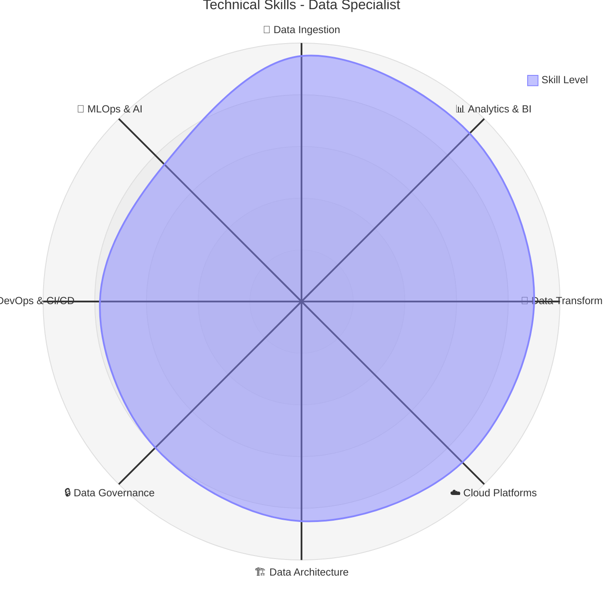

# 👋 Hi! I'm Erick Sang Cifuentes

  

  
  
  
  

---

## 🚀 About Me

Data Engineer passionate about open source solutions and scalable architectures. Specialist in robust pipelines, complex data transformation, and actionable insights generation. My focus: clean code, automation, and collaboration.

**In this GitHub you'll find:**
- 🔧 Data Engineering Projects: ETL/ELT, automated pipelines, cloud-native architectures
- 📊 Analytics Tools: Dashboards, Python scripts, BI solutions
- 🤖 AI Experiments: MLOps, predictive models, virtual assistants
- 🛠️ Utilities & Scripts: Useful automations for daily work

**Coding Philosophy:**
- 📝 Clear documentation and practical examples
- 🧪 Testing and production quality
- 🌍 Open Source and collaboration
- 🚀 Constant innovation and exploration

---

## 🛠️ Tech Stack

**Cloud:**  
AWS | Azure | GCP | Snowflake | Databricks

**Databases:**  
PostgreSQL | MongoDB | Redis | S3 | BigQuery

**Data Engineering:**  
Spark | Kafka | Airflow | dbt | Airbyte

**BI & Visualization:**  
Power BI | Tableau | Looker | Grafana

**Languages:**  
Python | SQL | TypeScript | JavaScript

---

## 🎯 Technical Skills Radar

  

```mermaid
---
title: "Technical Skills - Data Specialist"
---
radar-beta
  axis ingestion["🔄 Data Ingestion"], analytics["📊 Analytics & BI"], transformation["🔧 Data Transformation"]
  axis cloud["☁️ Cloud Platforms"], architecture["🏗️ Data Architecture"], governance["🔒 Data Governance"]
  axis devops["🚀 DevOps & CI/CD"], mlops["🤖 MLOps & AI"]
  curve skills["Skill Level"]{95, 92, 90, 88, 85, 80, 78, 75}
  max 100
  min 0
  graticule circle
  ticks 5
```

---

## 🏆 Achievements & Featured Projects

- **🚀 Real-time Data Pipeline:** Real-time processing with Kafka, Spark Streaming, and AWS  
  *80% less processing time*
- **☁️ Data Warehouse Migration:** Cloud-native migration with Snowflake, dbt, and Airflow  
  *10x performance, 60% cost reduction*
- **🤖 ML Model Pipeline:** End-to-end ML pipeline with MLOps  
  *Full automation and +15% accuracy*

---

## 💼 Professional Experience

**🏢 Data Engineer - Consulting** | SohoHumantech | Jun 2025 - Aug 2025  
**🎓 Data Engineer - Technical Lead** | CUN | Feb 2025 - Jun 2025  
**🏭 Data Engineer - Project Lead** | FACTECH | Aug 2024 - Jan 2025  
**💰 Data Specialist** | Teleperformance | Dec 2021 - Jul 2024  
**📊 Senior Visualization Architect** | Nexa BPO | Jan 2019 - Nov 2021  
**🖥️ Systems Coordinator** | Gaviria & Borbón | Jun 2018 - Jul 2019  

*Full details in my [Portfolio](https://ericksang.dev)*

---

## 🎓 Education & Certifications

**Education:**  
- Software Engineering | Politécnico Grancolombiano (8th semester)
- Technology in Automation and Robotics | ECCI

**Certifications:**  
- DataCamp: Associate Data Engineer SQL, Data Engineer Python
- Scrum Fundamentals Certified
- LinkedIn Learning: Python, SQL, Power BI

---

## 🌟 Featured Project

<!-- Here you can add the description of your real featured project -->

---

## 🤝 Connect With Me

  
  
  
  

---

  
  <h3>💡 "Turning data into actionable insights, one pipeline at a time" 💡</h3>
  ⚡ Built with ❤️ by <a href="https://github.com/Leonsang">Erick Sang</a> ⚡

