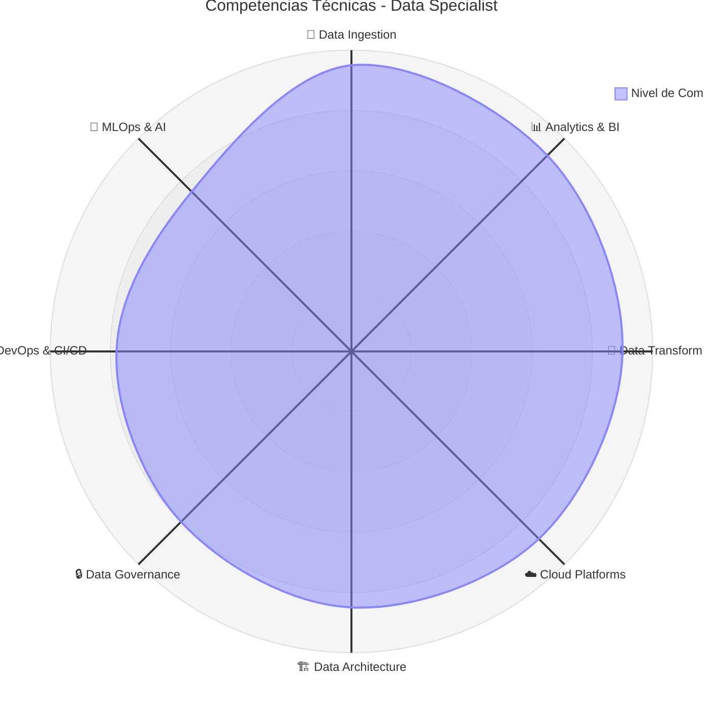

# 👋 ¡Hola! Soy Erick Sang Cifuentes

  

  
  
  
  

---

## 🚀 Sobre Mí

**Profesional integral en el ecosistema de datos y tecnología.** Desde análisis exploratorio hasta arquitecturas de ML en producción. Combino la mentalidad analítica de un Data Scientist, las habilidades técnicas de un Data Engineer, y la visión estratégica de un Solutions Architect.

**Mi perfil integral abarca:**
- 📊 **Data Analytics**: Desde SQL complejo hasta visualizaciones executive-level
- 🔧 **Data Engineering**: Pipelines robustos, transformaciones complejas, arquitecturas escalables
- ☁️ **Arquitectura AWS/Azure/GCP**: EC2, Lambda, S3, BigQuery, Databricks, Snowflake
- 🚀 **DevOps & Platform**: Docker, Kubernetes, Terraform, GitHub Actions, pipelines CI/CD
- 🤖 **Applied Data Science**: ML en producción con MLflow, MLOps, modelos predictivos
- 💻 **Full-Stack Development**: Aplicaciones Python, TypeScript, React con componentes de datos

**En este GitHub encontrarás:**
- 🏗️ Arquitecturas completas: Del ingesta al insight, del modelo al dashboard
- 📚 Mi base de conocimiento: Notas, trucos y aprendizajes documentados
- 🔬 Experimentos: PoCs, nuevas tecnologías, casos de uso innovadores
- 🛠️ Herramientas prácticas: Scripts, automatizaciones y utilities del día a día

**Filosofía técnica:**
- 🎯 **Business-first**: La tecnología sirve al negocio, no al revés
- 📝 **Knowledge sharing**: Documentar para el equipo y la comunidad
- 🧪 **Quality-driven**: Testing, monitoring y observability siempre
- 🌍 **End-to-end thinking**: Desde el dato crudo hasta el valor de negocio

---

## 🛠️ Stack Tecnológico

**Servicios AWS:**
EC2, Lambda, S3, RDS, Redshift, Glue, EMR, Kinesis, CloudFormation

**Servicios Azure:**
Virtual Machines, Functions, Blob Storage, SQL Database, Synapse, Data Factory, Databricks

**Servicios GCP:**
Compute Engine, Cloud Functions, Cloud Storage, BigQuery, Dataflow, Pub/Sub

**Plataformas de Datos:**
Snowflake, Databricks, Apache Spark, Apache Kafka, Apache Airflow

**Bases de Datos:**
PostgreSQL, MongoDB, Redis, MySQL, SQL Server, BigQuery

**Herramientas de Ingeniería de Datos:**
dbt, Airbyte, Apache Spark, Apache Kafka, Apache Airflow, Great Expectations

**BI & Visualización:**
Power BI, Tableau, Looker, Grafana, Apache Superset

**Lenguajes:**
Python, SQL, TypeScript, JavaScript, Scala, R

**DevOps e Infraestructura:**
Docker, Kubernetes, Terraform, Ansible, GitHub Actions, Jenkins, Prometheus

---

## 🎯 Radar de Competencias Técnicas

  

---

## 🏆 Logros y Proyectos Destacados

- **🚀 Real-time Data Pipeline:** Procesamiento en tiempo real con Kafka, Spark Streaming y AWS
  *80% menos tiempo de procesamiento*
- **☁️ Data Warehouse Multi-Nube:** Migración cloud-native con Snowflake, dbt y Airflow en AWS/Azure
  *10x performance, 60% reducción de costos*
- **🤖 Pipeline MLOps:** Pipeline end-to-end para ML con MLflow, Databricks y despliegue automatizado
  *Automatización total y +15% accuracy*

---

## 💼 Experiencia Profesional

**🏢 Data Engineer - Consulting** | SohoHumantech | Jun 2025 - Ago 2025
**🎓 Data Engineer - Technical Lead** | CUN | Feb 2025 - Jun 2025
**🏭 Data Engineer - Project Lead** | FACTECH | Ago 2024 - Ene 2025
**💰 Data Specialist** | Teleperformance | Dic 2021 - Jul 2024
**📊 Senior Visualization Architect** | Nexa BPO | Ene 2019 - Nov 2021
**🖥️ Coordinador de Sistemas** | Gaviria & Borbón | Jun 2018 - Jul 2019

*Detalles completos en mi [Portfolio](https://ericksang.dev)*

---

## 🎓 Educación & Certificaciones

**Educación:**
- Ingeniería de Software | Politécnico Grancolombiano (8vo semestre)
- Tecnología en Automatización y Robótica | ECCI

**Certificaciones:**
- DataCamp: Associate Data Engineer SQL, Data Engineer Python
- Scrum Fundamentals Certified
- LinkedIn Learning: Python, SQL, Power BI
- AWS Solutions Architect Associate (En Progreso)
- Azure Data Engineer Associate (En Progreso)

---

## 🌟 Qué Encontrarás Aquí

Este repositorio contiene mi base de conocimiento personal con ejemplos prácticos y documentación cubriendo:

**Ingeniería de Datos:**
- Tutoriales de Apache Spark y transformaciones avanzadas
- Implementaciones de Apache Kafka y procesamiento en tiempo real
- DAGs de Apache Airflow y orquestación de workflows
- Modelos dbt y transformaciones de datos

**Plataformas en la Nube:**
- Integración de servicios AWS y arquitecturas
- Implementaciones de Azure Databricks y Synapse
- Flujos de trabajo de GCP BigQuery
- Arquitecturas de datos multi-nube

**DevOps y Automatización:**
- Containerización Docker para aplicaciones de datos
- Despliegues Kubernetes para servicios de datos
- Infraestructura como código con Terraform
- Pipelines CI/CD para proyectos de datos

**Analítica y BI:**
- Técnicas avanzadas de SQL y optimización
- Desarrollo de dashboards en Power BI
- Análisis de datos con Python y visualización
- Notebooks Jupyter con ejemplos del mundo real

---

## 🤝 Conecta Conmigo

  
  
  
  

---

  
  <h3>💡 "Transformando datos en insights accionables, un pipeline a la vez" 💡</h3>
  ⚡ Construido con ❤️ por <a href="https://github.com/Leonsang">Erick Sang</a> ⚡

