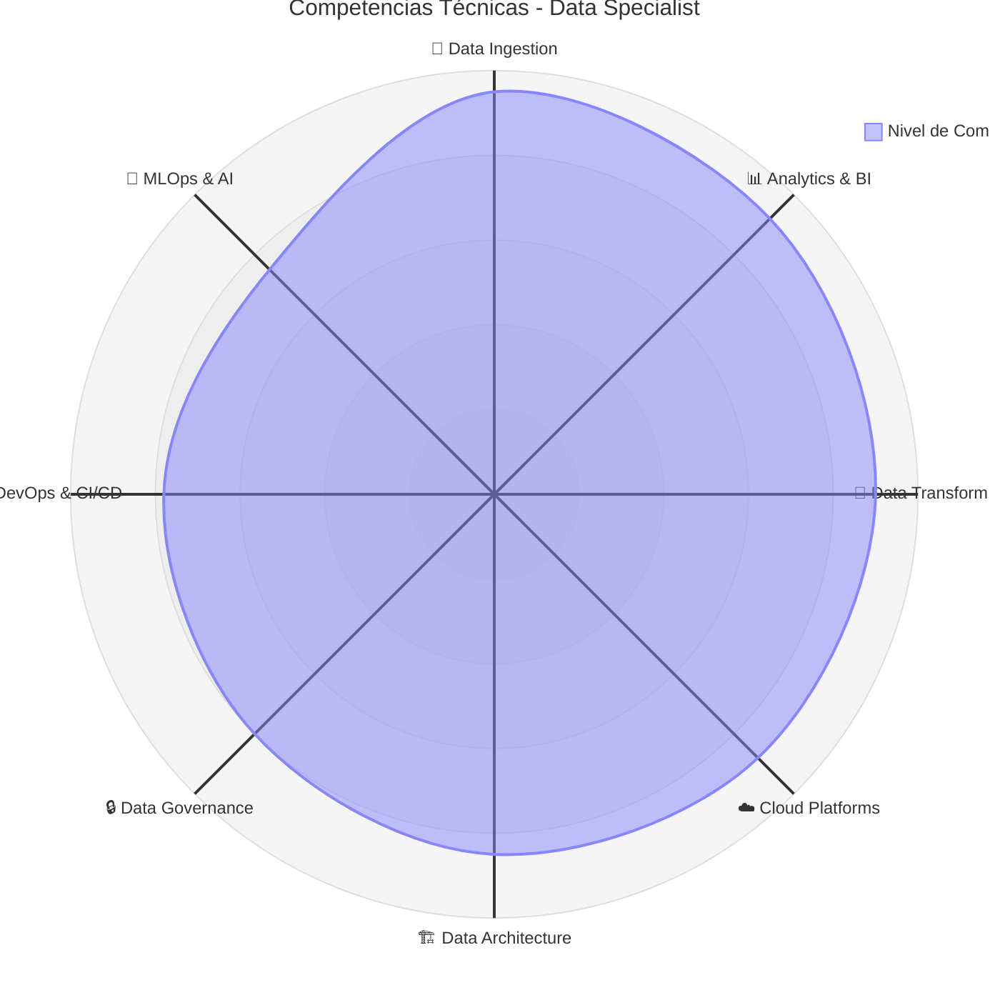

# 👋 ¡Hola! Soy Erick Sang Cifuentes

  

  
  
  
  

---

## 🚀 Sobre Mí

Ingeniero de Datos apasionado por las soluciones open source y arquitecturas escalables. Especialista en pipelines robustos, transformación de datos complejos y generación de insights accionables. Mi enfoque: código limpio, automatización y colaboración.

**En este GitHub encontrarás:**
- 🔧 Proyectos de Data Engineering: ETL/ELT, pipelines automatizados y arquitecturas cloud-native
- 📊 Herramientas de Analytics: Dashboards, scripts Python y soluciones BI
- 🤖 Experimentos con IA: MLOps, modelos predictivos y asistentes virtuales
- 🛠️ Utilities & Scripts: Automatizaciones útiles para el día a día

**Filosofía de código:**
- 📝 Documentación clara y ejemplos prácticos
- 🧪 Testing y calidad para producción
- 🌍 Open Source y colaboración
- 🚀 Innovación y exploración constante

---

## 🛠️ Stack Tecnológico

**Cloud:**  
AWS | Azure | GCP | Snowflake | Databricks

**Bases de Datos:**  
PostgreSQL | MongoDB | Redis | S3 | BigQuery

**Data Engineering:**  
Spark | Kafka | Airflow | dbt | Airbyte

**BI & Visualización:**  
Power BI | Tableau | Looker | Grafana

**Lenguajes:**  
Python | SQL | TypeScript | JavaScript

---

## 🎯 Radar de Competencias Técnicas

  

```mermaid
---
title: "Competencias Técnicas - Data Specialist"
---
radar-beta
  axis ingestion["🔄 Data Ingestion"], analytics["📊 Analytics & BI"], transformation["🔧 Data Transformation"]
  axis cloud["☁️ Cloud Platforms"], architecture["🏗️ Data Architecture"], governance["🔒 Data Governance"]
  axis devops["🚀 DevOps & CI/CD"], mlops["🤖 MLOps & AI"]
  curve skills["Nivel de Competencia"]{95, 92, 90, 88, 85, 80, 78, 75}
  max 100
  min 0
  graticule circle
  ticks 5
```

---

## 🏆 Logros y Proyectos Destacados

- **🚀 Real-time Data Pipeline:** Procesamiento en tiempo real con Kafka, Spark Streaming y AWS  
  *80% menos tiempo de procesamiento*
- **☁️ Data Warehouse Migration:** Migración a cloud-native con Snowflake, dbt y Airflow  
  *10x performance, 60% reducción de costos*
- **🤖 ML Model Pipeline:** Pipeline end-to-end para ML con MLOps  
  *Automatización total y +15% accuracy*

---

## 💼 Experiencia Profesional

**🏢 Data Engineer - Consulting** | SohoHumantech | Jun 2025 - Ago 2025  
**🎓 Data Engineer - Technical Lead** | CUN | Feb 2025 - Jun 2025  
**🏭 Data Engineer - Project Lead** | FACTECH | Ago 2024 - Ene 2025  
**💰 Data Specialist** | Teleperformance | Dic 2021 - Jul 2024  
**📊 Senior Visualization Architect** | Nexa BPO | Ene 2019 - Nov 2021  
**🖥️ Coordinador de Sistemas** | Gaviria & Borbón | Jun 2018 - Jul 2019  

*Detalles completos en mi [Portfolio](https://ericksang.dev)*

---

## 🎓 Educación & Certificaciones

**Educación:**  
- Ingeniería de Software | Politécnico Grancolombiano (8vo semestre)
- Tecnología en Automatización y Robótica | ECCI

**Certificaciones:**  
- DataCamp: Associate Data Engineer SQL, Data Engineer Python
- Scrum Fundamentals Certified
- LinkedIn Learning: Python, SQL, Power BI

---

## 🌟 Proyecto Destacado

<!-- Aquí puedes agregar la descripción de tu proyecto destacado real -->

---

## 🤝 Conecta Conmigo

  
  
  
  

---

  
  <h3>💡 "Transformando datos en insights accionables, un pipeline a la vez" 💡</h3>
  ⚡ Construido con ❤️ por <a href="https://github.com/Leonsang">Erick Sang</a> ⚡

