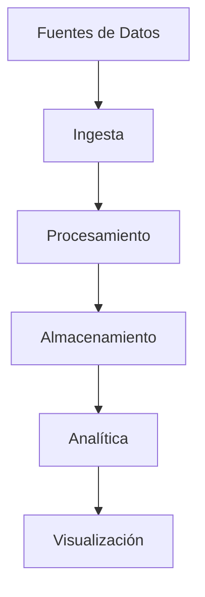

# Data Engineering

> "Transformando datos en valor real para el negocio."

---

## 🚀 ¿Qué es Data Engineering?

La ingeniería de datos es el arte de diseñar, construir y mantener sistemas que permiten la recolección, almacenamiento, procesamiento y análisis eficiente de grandes volúmenes de datos. Es la base para la analítica avanzada, la inteligencia artificial y la toma de decisiones basada en datos.

---

## 🛠️ Herramientas y Tecnologías Clave

- **ETL/ELT:** Airflow, dbt, Spark, Talend, Dataflow
- **Orquestación:** Apache Airflow, Prefect
- **Procesamiento:** Apache Spark, Databricks, Flink
- **Almacenamiento:** Data Lakes (S3, GCS), Data Warehouses (BigQuery, Snowflake, Redshift)
- **Streaming:** Apache Kafka, AWS Kinesis
- **Automatización:** Python, Bash, Terraform

---

## 🧩 Arquitectura Moderna



---

## 💡 Buenas Prácticas

!!! tip "Automatiza todo lo que puedas"
    Usa orquestadores y scripts para reducir errores manuales y mejorar la escalabilidad.

!!! info "Documenta y versiona tus pipelines"
    dbt y Airflow permiten mantener control y trazabilidad sobre los flujos de datos.

!!! success "Monitorea y alerta"
    Implementa monitoreo y alertas para detectar fallos y cuellos de botella a tiempo.

---

## 📚 Recursos Recomendados

- [The Data Engineering Cookbook](https://github.com/AndreasKretz/Data-Engineering-Cookbook)
- [Awesome Data Engineering](https://github.com/igorbarinov/awesome-data-engineering)
- [Airflow Best Practices](https://airflow.apache.org/docs/apache-airflow/stable/best-practices.html)
- [dbt Documentation](https://docs.getdbt.com/docs/introduction)

---

## 📝 Ejemplo de Pipeline ETL con Airflow

```python
from airflow import DAG
from airflow.operators.python import PythonOperator
from datetime import datetime

def extract():
    # Extracción de datos
    pass

def transform():
    # Transformación de datos
    pass

def load():
    # Carga de datos
    pass

default_args = {
    'owner': 'ericksang',
    'start_date': datetime(2023, 1, 1),
}

dag = DAG('etl_pipeline', default_args=default_args, schedule_interval='@daily')

extract_task = PythonOperator(task_id='extract', python_callable=extract, dag=dag)
transform_task = PythonOperator(task_id='transform', python_callable=transform, dag=dag)
load_task = PythonOperator(task_id='load', python_callable=load, dag=dag)

extract_task >> transform_task >> load_task
```

---

¿Tienes dudas o quieres ver ejemplos de otros flujos? ¡Contáctame o revisa los notebooks embebidos!
