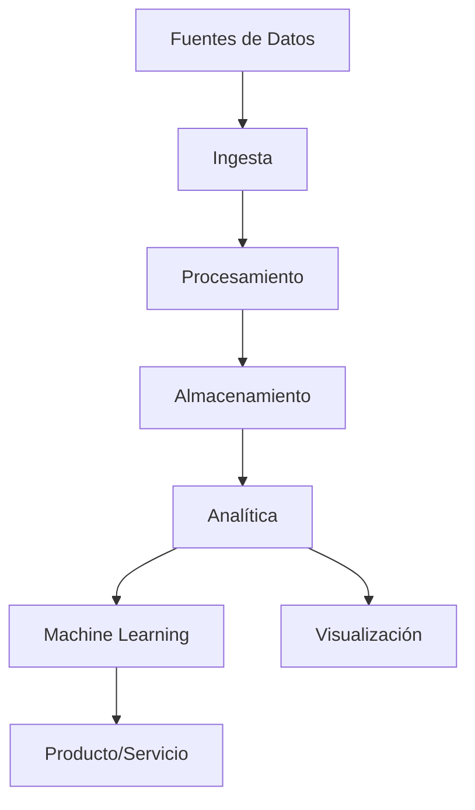

# Others

Otros temas y herramientas relevantes para ingeniería de datos.

# Big Data & Landscape General

> "Big Data no es solo volumen, es velocidad, variedad y valor."

---

## 🌎 ¿Qué es Big Data?

Big Data se refiere al manejo y procesamiento de grandes volúmenes de datos que no pueden ser gestionados con herramientas tradicionales. Implica trabajar con datos estructurados y no estructurados, provenientes de múltiples fuentes y en tiempo real.

---

## 🏞️ Landscape General de Data Engineering

---

## 🏢 Ecosistema de Big Data

- **Procesamiento distribuido:** Apache Spark, Hadoop, Flink
- **Almacenamiento escalable:** HDFS, S3, BigQuery, Snowflake
- **Streaming:** Kafka, Kinesis, Pulsar
- **Orquestación:** Airflow, Luigi, Prefect
- **Machine Learning:** MLlib, TensorFlow, PyTorch
- **Visualización:** Power BI, Tableau, Grafana

---

## 💡 Retos y Oportunidades

!!! warning "Retos"
    - Escalabilidad y performance
    - Seguridad y gobernanza
    - Integración de fuentes heterogéneas

!!! success "Oportunidades"
    - Analítica avanzada
    - Personalización de productos
    - Automatización inteligente

---

## 📚 Recursos

- [Big Data Landscape](https://mattturck.com/data2024/)
- [Awesome Big Data](https://github.com/onurakpolat/awesome-bigdata)
- [Spark Documentation](https://spark.apache.org/docs/latest/)
- [Hadoop Ecosystem](https://hadoopecosystemtable.github.io/)

---

# Otros Temas y Herramientas

> "El ecosistema data engineering evoluciona constantemente."

---

## 🧰 Herramientas y Temas Relevantes

- **Airbyte:** Ingesta de datos open source, alternativa a Fivetran y Talend.
- **Prefect:** Orquestación moderna, fácil integración con cloud y Python.
- **Luigi:** Orquestador de workflows por Spotify, robusto y flexible.
- **Terraform:** Infraestructura como código para despliegue cloud.
- **Great Expectations:** Validación y calidad de datos automatizada.
- **Vault:** Gestión de secretos y credenciales.
- **Open Policy Agent:** Gobernanza y control de acceso.

---

## 💡 Buenas Prácticas

!!! tip "Explora y experimenta"
    Prueba nuevas herramientas y comparte tus hallazgos con la comunidad.

!!! info "Automatiza la infraestructura"
    Usa IaC (Infrastructure as Code) para reproducibilidad y escalabilidad.

!!! success "Contribuye a open source"
    Participa en proyectos, reporta bugs y comparte mejoras.

---

## 📚 Recursos

- [Awesome Data Engineering](https://github.com/igorbarinov/awesome-data-engineering)
- [Awesome Open Source](https://github.com/awesome-selfhosted/awesome-selfhosted)
- [Prefect Documentation](https://docs.prefect.io/)
- [Airbyte Documentation](https://docs.airbyte.com/)
- [Terraform Docs](https://www.terraform.io/docs/index.html)

---

¿Quieres saber más sobre arquitecturas Big Data o ver ejemplos prácticos? ¡Explora los notebooks y recursos del sitio!
