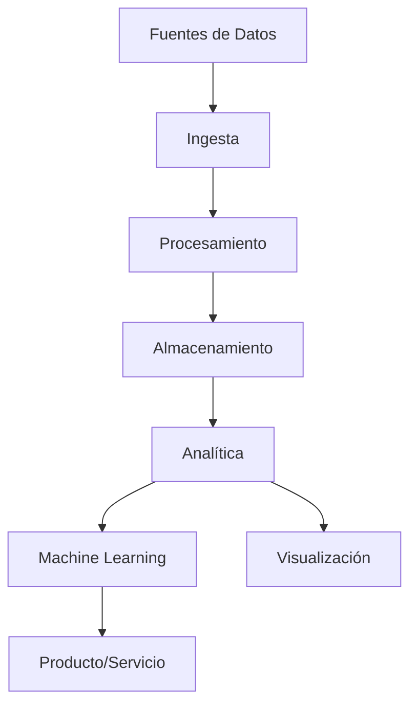

# Others

Otros temas y herramientas relevantes para ingeniería de datos.

# Big Data & Landscape General

> "Big Data no es solo volumen, es velocidad, variedad y valor."

---

## 🌎 ¿Qué es Big Data?

Big Data se refiere al manejo y procesamiento de grandes volúmenes de datos que no pueden ser gestionados con herramientas tradicionales. Implica trabajar con datos estructurados y no estructurados, provenientes de múltiples fuentes y en tiempo real.

---

## 🏞️ Landscape General de Data Engineering

```mermaid
graph TD;
  FUENTES[Fuentes de Datos] --> INGESTA[Ingesta]
  INGESTA --> PROCESAMIENTO[Procesamiento]
  PROCESAMIENTO --> ALMACENAMIENTO[Almacenamiento]
  ALMACENAMIENTO --> ANALITICA[Analítica]
  ANALITICA --> ML[Machine Learning]
  ANALITICA --> VISUALIZACION[Visualización]
  ML --> PRODUCTO[Producto/Servicio]
```

---

## 🏢 Ecosistema de Big Data

- **Procesamiento distribuido:** Apache Spark, Hadoop, Flink
- **Almacenamiento escalable:** HDFS, S3, BigQuery, Snowflake
- **Streaming:** Kafka, Kinesis, Pulsar
- **Orquestación:** Airflow, Luigi, Prefect
- **Machine Learning:** MLlib, TensorFlow, PyTorch
- **Visualización:** Power BI, Tableau, Grafana

---

## 💡 Retos y Oportunidades

!!! warning "Retos"
    - Escalabilidad y performance
    - Seguridad y gobernanza
    - Integración de fuentes heterogéneas

!!! success "Oportunidades"
    - Analítica avanzada
    - Personalización de productos
    - Automatización inteligente

---

## 📚 Recursos

- [Big Data Landscape](https://mattturck.com/data2024/)
- [Awesome Big Data](https://github.com/onurakpolat/awesome-bigdata)
- [Spark Documentation](https://spark.apache.org/docs/latest/)
- [Hadoop Ecosystem](https://hadoopecosystemtable.github.io/)

---

¿Quieres saber más sobre arquitecturas Big Data o ver ejemplos prácticos? ¡Explora los notebooks y recursos del sitio!
